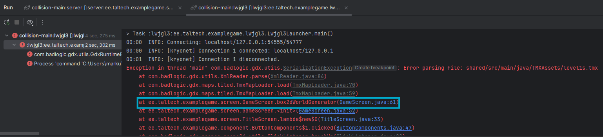
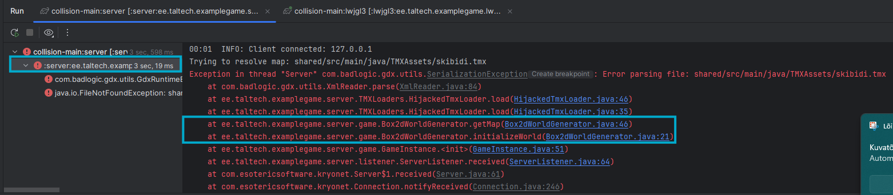
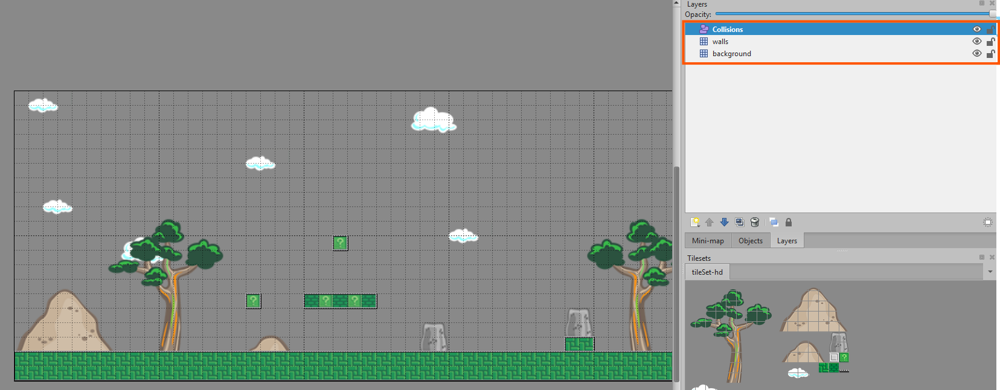
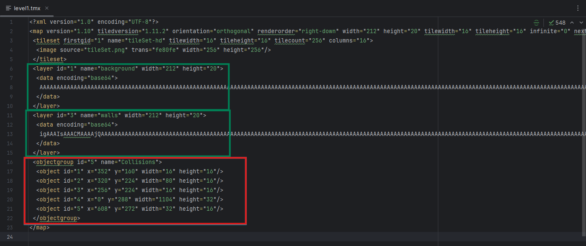

# Collisionid ja füüsika

Tegemist on projektiga, kus osa funktsionaalsusest on teadlikult eemaldatud ning sinu ülesanne on need samm-sammult tagasi lisada. Töötoa eelduseks on, et oled läbinud kliendi ja serveri töötoa ning arvutimängu töötoa.

Pärast materjalidega tutvumist loo isiklik koopia (fork) sellest repositooriumist, mille kallal saad töötada.

Täiesti korrektse ja valmis funktsionaalsustega töötoa koodi leiad [siit](https://gitlab.cs.taltech.ee/iti0301-2026/collision-main). NB! Palun tutvu enne töötoaga alustamist esialgse projektiga ja selle READMEga.


Projekti on lisatud ka kaust `TMXLoaders`, mis vastutab Tiledi kaartide parsimise eest serveri poolel. Neid faile ei ole vaja muuta.


---

Soovitused lugemiseks:

- [Mis on Tiled?](https://gamedevdoc.pages.taltech.ee/tiledmap/tiledmap.html)
- [Tiled collisionid](https://gamedevdoc.pages.taltech.ee/tile-collision/tile-collision.html)
- [Skeem mängu arhitektuurist](https://excalidraw.com/#json=kq2idkeEMGFr-LRx4AVKx,Qv7z8Ks417BKfwIkaTcV5A)
- [Youtube tutorial LibGDX mängu loomiseks (ei ole serverit kasutatud, aga väga sarnane ning hea vaadata)](https://www.youtube.com/watch?v=a8MPxzkwBwo)
---


### Ülesanne 1 — Mäng ei alga, kui start vajutada

Hetkel ei alga mäng pärast `Start` nupu vajutamist. Selle asemel mäng crashib ning konsooli ilmub error.

Uuri errorit ning püüa aru saada, mis on valesti.

<details>
<summary>💡 Vihje 1</summary>
Probleem seisneb selles, et Java ei leia kaardifaili üles.

Vajuta esmalt Klient vaate peale ning seejärel noole peale, et näha konsooli output’i. Veidi ülespoole kerides peaksid nägema, millises failis ja millisel real error tekib.


</details>

<details>
<summary>💡 Vihje 2</summary>


Esimene error meie koodis tekib `GameScreen` klassis real 61, kus üritatakse kaardifaili laadida. Navigeeri sinna kas errorile klõpsates või avades faili käsitsi.
</details>

<details>
<summary>💡 Vihje 3</summary>

Õige `.tmx` fail asub kaustas `shared/src/main/java/TMXAssets`
</details>

<details>
<summary>🛠 Lahendus</summary>

Õige kood on:
`this.map = mapLoader.load("shared/src/main/java/TMXAssets/level1.tmx");`
</details>

<details>
<summary>✅ Selgitus</summary>

Kõik .tmx failid peavad asuma kaustas `Shared/TMXAssets`, sest neid kasutavad nii klient kui ka server.
- Klient kasutab kaarti kujunduse renderdamiseks
- Server kasutab kaarti Box2D maailma ja collisionite genereerimiseks

Faili nime muutes tuleb alati veenduda, et path on õige nii kliendi kui serveri poolel.
</details>

---

### Ülesanne 2 — Mäng on väga väike

Mäng käivitub nüüd edukalt, kuid kaart tundub liiga väike. Tegelikult näitab kaamera korraga liiga suurt ala ning mängumaailm paistab justkui „kaugel“.

Probleem esineb kaamera seadistuses.
<details>
<summary>💡 Vihje 1</summary>

Probleem on jällegi `GameScreen` klassis, kus kaamera luuakse ja seadistatakse.
</details>

<details>
<summary>💡 Vihje 2</summary>

Uuri `GameScreen` klassi rida 58.
</details>

<details>
<summary>💡 Vihje 3</summary>

Kaamera kõrgus on õigesti seadistatud, kuid laius on liiga suur.
</details>

<details>
<summary>🛠 Lahendus</summary>

Õige kood on:
`camera.setToOrtho(false, Gdx.graphics.getWidth() / PPM, Gdx.graphics.getHeight() / PPM);`
</details>

<details>
<summary>✅ Selgitus</summary>

Tiled kaardi ja Box2D maailma skaleering on määratud PPM-i (pixels per meter) abil, kus 100 pikslit vastab 1 meetrile.
Kuna TiledMap kasutab piksleid ja Box2D maailm meetriteid, tuleb pikslid teisendada meetriteks, et mõõtühikud ühtiksid.

Esialgu oli kaardi laius 640px  ning kõrgus 4.8m (480 / 100), mistõttu oli kaart väga väikene, kuna kaamera luges selle laiuseks 640m.

Server töötab Box2D ühikutes (meetrites), kuid enne kliendile saatmist teisendatakse väärtused pikslitesse, korrutades need PPM-iga.

Seetõttu tuleb kliendi poolel kõik mõõtmed – nagu kaamera viewport ja objektide positsioonid – jagada PPM-iga, et need ühtiksid Box2D maailma ühikutega.
</details>

---

### Ülesanne 3 — Tegelasi ei renderdata ning serveris on errorid

Nüüd "Start" nupule vajutades mäng avaneb, aga tegelasi ei kuvata ning serveri konsoolis tekivad errorid.

Uuri serveri erroreid ning leia, mis on valesti.


<details>
<summary>💡 Vihje 1</summary>

Vajuta alguses `Server` lahtri peale ning siis noole peale, et näha errorit konsoolis. Natuke üles kerides peaks nägema, kus failis ning mis real errorid tekivad.


</details>

<details>
<summary>💡 Vihje 2</summary>


Uuri `Box2DWorldGenerator` klassi serveris ridu 21 ja 46.

</details>

<details>
<summary>💡 Vihje 3</summary>

Probleem on `getMap()` meetodis.
</details>

<details>
<summary>🛠 Lahendus</summary>

Õige kood on:


```java
public TiledMap getMap() {
        return new HijackedTmxLoader(new MyServer.MyFileHandleResolver())
                .load("shared/src/main/java/TMXAssets/level1.tmx");}
```
</details>

<details>
<summary>✅ Selgitus</summary>

Jällegi oli probleem kaardifaili path'is ning tuleb meeles pidada, et `.tmx` fail on kasutusel nii serveris, kui ka kliendi poolel.
</details>

---

### Ülesanne 3.1 — MapLayer is `null`? - serveris on ikka errorid

Start nupule vajutades otseselt palju ei ole muutunud ning ikka on errorid serveris. Jälgi Serveri konsooli, et uurida erroreid.


<details>
<summary>💡 Vihje 1</summary>

```text
Exception in thread "Server" java.lang.NullPointerException: Cannot invoke "com.badlogic.gdx.maps.MapLayer.getObjects()" because "mapLayer" is null
at ee.taltech.examplegame.server.game.Box2dWorldGenerator.initializeWorld(Box2dWorldGenerator.java:29)
```

Error tekib `Box2DWorldGenerator` klassis reas 29.
</details>

<details>
<summary>💡 Vihje 2</summary>

`mapLayer` on `null`, mis tähendab, et Tiled kaardilt ei leitud layerit nimega "kollisionid".
Uuri Tiled kaarti, et näha, mis layerid eksisteerivad.

Seda saab teha kahte moodi:
1. Ava Tiled-is level1.tmx fail lahti ning uuri layerite nimekirja.
2. Tee level1.tmx fail lahti IDE-s ning uuri millised layerid seal on.

</details>

<details>
<summary>💡 Vihje 3</summary>

Punasega pildil on märgitud TiledMapi layerid. Collisions on loodud "object layer" tüüpi layerina ning selle nimi on "Collisions", aga koodis otsitakse "kollisionid".




</details>

<details>
<summary>🛠 Lahendus</summary>

Õige kood on `Box2DWorldGenerator` klassis real 22:


```java
MapLayer mapLayer = tiledMap.getLayers().get("Collisions");
```
</details>

<details>
<summary>✅ Selgitus</summary>

getMap() Loeb Tiled kaardi ning mapLayer leiab ühe layeri täpselt nime järgi.
Kui Tiled kaardil ja koodis olev nimi ei ühti, tagastatakse null.
```java
TiledMap tiledMap = getMap();
MapLayer mapLayer = tiledMap.getLayers().get("Collisions");
```
Lisades enda Tiled kaardile uue Collision layeri, tuleb veenduda, et layeri nimi koodis ja Tiled kaardil ühtiksid.
</details>

---

### Ülesanne 4 — Oota mida, miks koaala nii suur on?

Mäng töötab nüüd ilusti ilma erroriteta, aga miks mängija on nii pikk? Tegelase laius tundub normaalne, aga kõrgus on liiga suur.

Uuri:

- Kus renderdatakse mängijat
- Tegelase kõrgust ja laiust ning kuidas nad erinevad


<details>
<summary>💡 Vihje 1</summary>

Probleemi asub kliendi poolel.
</details>

<details>
<summary>💡 Vihje 2</summary>

Vaata `core/game/Player` klassi.
</details>

<details>
<summary>💡 Vihje 3</summary>

Uuri kuidas kõrgust ja laiust renderdatakse real 34.
</details>

<details>
<summary>🛠 Lahendus</summary>

Mängija kõrgus oli jäänud PPM-iga läbi jagamata.


Õige kood on real 34:
`float h = PLAYER_HEIGHT_IN_PIXELS / PPM;`
</details>

<details>
<summary>✅ Selgitus</summary>


Kuna tegelase suurus on määratud pikslites ning kaamera, koos kaardiga töötab meetrites, tuleb pikslid teisendada meetriteks, et kõik oleks oleks kooskõlas. Seetõttu oligi koaala nii suur, kuna 32 pikslit tõlgendati 32 meetrina.
Siin tuleb taas arvestada PPM-iga. Kõik mõõtmed peavad olema jagatud PPM-iga kliendi poolel, et need ühtiksid Box2D maailma ühikutes.

Kui mõni PPM-iga jagamine ununeb, võib koaala ootamatult hiiglaseks kasvada.
</details>

---

### Ülesanne 5 — Kas me ei tulnud siia mitte collisioneid tegema?

Leidsime koaala üles, aga Collisionid mitte. Tegelane on alguses nähtav, kuid kukub seejärel läbi põranda. Proovi ka `WASD` nuppe, et kontrollida, kas liikumine toimib.

Tiled-is on olemas collision layer, mis on üles seatud *ristkülikutena*. Miks collisionid siiski ei tööta?


<details>
<summary>💡 Vihje 1</summary>

Collisionid genereeritakse serveri poolel `Box2dWorldGenerator` klassis.
</details>

<details>
<summary>💡 Vihje 2</summary>

Probleem esineb ridadel 29-30.
</details>

<details>
<summary>💡 Vihje 3</summary>

Kui collisionid on Tiledis loodud ristkülikutena, kas kasutatav MapObject tüüp on ikka õige?
</details>

<details>
<summary>🛠 Lahendus</summary>

On olemas erinevad MapObject tüübid, näiteks PolygonMapObject, RectangleMapObject, CircleMapObject jne (ellipsid,  ringid, ristkülikud, kolmnurgad). Kuna meie collisionid on ristkülikutena, siis peaks kasutama RectangleMapObject tüüpi.

Korrektne kood on:

```java
for (RectangleMapObject object : mapLayer.getObjects().getByType(RectangleMapObject.class)) {
            Rectangle rectangle = object.getRectangle();
```
</details>

<details>
<summary>✅ Selgitus</summary>

Kuna meie koodis oli valesti üles seadistatud MapObject tüüp, siis Box2D maailmas collisionid ei genereerunudki. Selle tulemusena kukkus tegelane läbi põranda.

Oluline on kasutada õiget tüüpi MapObjecti, mis vastab meie Tiled kaardi collision layeri objektidele.
Praegu on loodud collisionid ristkülikukujulised, aga võivad ka olla ringid, ellipsid, kolmnurgad jne. Selle põhjal tuleb valida õige MapObject tüüp.

Kui ühes kaardis on kasutusel mitu erinevat objekti tüüpi, saab nende tüübi tuvastamiseks kasutada if-checke, ning selle põhjal saab luua igale objektile vastava kujuga collisionid.
</details>

---


### Ülesanne 6 — See on lind? See on lennuk? See on... KOAALA?

Leidsime Collisionid ülesse, aga tal on liiga palju energiat, äkki tahab ta kuu peale hüpata?

Investigate 🕵️ 🔎:

- Liikumist, hüppamist ja kuidas nad erinevad

<details>
<summary>💡 Vihje 1</summary>

Liikumise füüsika toimub `Serveri` poolel `Player` klassis.
</details>

<details>
<summary>💡 Vihje 2</summary>

Probleem on hüppamise kiiruse väärtuses.
</details>

<details>
<summary>💡 Vihje 3</summary>

Selle leiab Sharedi `Constants.java` failist. realt 17.
</details>

<details>
<summary>🛠 Lahendus</summary>

`JUMP_VELOCITY` väärtus oli liiga suur. Sinu mängus vali endale sobiv väärtus, siin mängus sobib hästi näiteks 4f.

`public static final float JUMP_VELOCITY = 4f;`
</details>

---

Kui juba siin oleme siis, võiks ka gravitatsiooni viimistleda, et hüpped oleksid veidi realistlikumad.

<details>
<summary>🛠 Lahendus</summary>

Praegu oleme kuu peal, aga tuleks maa peale tagasi väärtusega -9.8f.

`public static final float GRAVITY = -9.8f;`
</details>

---
Praegu mängides, on PPM väärtus 50f, mis teeb mängu aeglaseks ja kohmakaks. Muuda see väärtus 100f-ks, et kõik oleks paremini skaleeritud.

<details>
<summary>🛠 Lahendus</summary>

PPM-i saab muuta `shared/src/main/java/constant/Constants.java` failis

Real 7:
`public static final float PPM = 100f;`
</details>


---
<details>


<summary>✅ Selgitus</summary>

Konstantidesse on hea panna kõik väärtused, mida kasutad mitu korda ning mis võivad aja jooksul muutuda. Nii on lihtne neid muuta ühes kohas ning need kehtivad kogu projekti ulatuses.

PPM-i väärtus võib ka muutuda sõltuvalt mängu suurusest ning vajadusest. Enamasti on hea väärtus 50f-200f vahel.

</details>

---


### Ülesanne 7 — YIPIII töötab!! Aga päris korras ta ka ei ole...

Collisionid töötavad, aga Koaala hõljub ja tulistamine on ka veider.

Probleem asub serveri poolel.

<details>
<summary>💡 Vihje 1</summary>

Uuri serveri `Player` klassi.
</details>

<details>
<summary>💡 Vihje 2</summary>

Hõljumise põhjuseks on liiga suur või vale kujuga hitbox.
</details>

<details>
<summary>💡 Vihje 3</summary>

Ridadel 77-79 esineb probleem ning hitbox on vales formaadis. Ta on loodud ringina, aga tegelane on rohkem ristkülikukujuline.
</details>

<details>
<summary>🛠 Lahendus</summary>


Õige hitboxi kuju on ristkülik:

```java
PolygonShape shape = new PolygonShape();
shape.setAsBox(10 / PPM, 15 / PPM);
```
</details>

<details>
<summary>✅ Selgitus</summary>

Box2D toetab erinevaid kujusid (CircleShape, PolygonShape jne).
Tegelase hitbox peaks võimalikult hästi vastama tema visuaalsele kujule, mitte tema `.png` suurusele. Seda peaks ise katsetama, et leida sobivaim kuju ja suurus.

Ära unusta ka mõõtmeid PPM-iga jagada.

</details>

--- 

Kui me juba siin oleme siis teeks ka mängija spawnimise asukoha paremaks. Pane mängija spawnima alla vasakule klotsi peale, mitte paremasse ülanurka.


<details>
<summary>💡 Vihje 1</summary>

x, y koordinaadid määravad ta spawnimise koha.
</details>

<details>
<summary>💡 Vihje 2</summary>

Rida 39-40
</details>


<details>
<summary>🛠 Lahendus</summary>

Õigele spawnimise kohale ei ole olemas kindlat vastust, vali endale sobiv koht, kus tundub loogiline alustada. See võib vajada natuke proovimist ja katsetamist. Vaata ka, et tegelane ei spawniks otse collisionite sisse.

Siin mängus sobiks hästi:

```java
private float x = 50f;
private float y = 50f;
```
</details>


---

### Ülesanne 8 — Tulistamine on veider

Tulistamine tuleb mapi alt, aga liigub temaga kaasas ilusti, ehk pooleldi töötab? Mis võiks valesti olla?
<details>
<summary>💡 Vihje 1</summary>

Probleem asub serveri `Player` klassis.
</details>

<details>
<summary>💡 Vihje 2</summary>

Uuri, kuidas `shoot(Direction direction)` meetod töötab.

Lisa juurde paar print lauset, mida saab näha serveri poolel konsoolis, et aru saada, kus täpselt bulletid spawnivad.

```java
public void shoot(Direction direction) {
    // x/y are synced from Box2D body position and represent the player's center in pixels.
    // Spawn bullet centered on the player.
    float spawnX = x - BULLET_WIDTH_IN_PIXELS / 2f;
    float spawnY = y - BULLET_HEIGHT_IN_PIXELS / 2f;
    System.out.println("Player position -> x: " + x + ", y: " + y);
    System.out.println("Bullet spawn position -> x: " + spawnX + ", y: " + spawnY);
    game.addBullet(new Bullet(spawnX, spawnY, direction, id));
}
```
</details>

<details>
<summary>💡 Vihje 3</summary>

Vigase koodi leiab `updateFromPhysics()` meetodis.
</details>
<details>
<summary>🛠 Lahendus</summary>

Korrektne kood on:

```java
public void updateFromPhysics() {
  if (body == null) return;
  this.x = body.getPosition().x * PPM;
  this.y = body.getPosition().y * PPM;
}
```
</details>

<details>
<summary>✅ Selgitus</summary>

Oluline on mõista, et selles projektis:
- `Player` kasutab Box2D füüsikat, mis töötab **meetrites**
- `Bullets` kasutavad lihtsamat liikumist, mis töötavad **pikslites**

Kui vaatad `Bullet.java` faili serveris, näed, et kuulide `update()` meetod liigutab neid lihtsalt `BULLET_SPEED` võrra iga tic-iga pikslites, mitte Box2D füüsikaga. Seega on oluline, et kuuli spawnimise asukoht toimuks samuti pikslites.

Kui see teisendus puudub, on `x` ja `y` väärtused meetrites (näiteks 5.2 meetrit), aga `shoot()` meetod eeldab neid olevat pikslites (näiteks 520 pikslit). Seetõttu spawnisid kuulid mapi alt, kuna `y`-asukoht oli 0.50, mitte 50px.

</details>


---

### Ülesanne 9 — Teeme ka liikumise loogilisemaks

Hetkel jääb koaala pärast liikumise alustamist liikuma, kuni vajutatakse `S`-klahvi. Samuti ei ole võimalik samal ajal liikuda ja hüpata. See muudab tegelase juhtimise kohmakaks ning kasutaja jaoks ebamugavaks.

Uuri, kuidas liikumise ja inputide loogika on praegu üles ehitatud ning miks ei ole võimalik mitut inputit korraga töödelda ning leida lahendus, kus:

- Tegelane saab liikuda ja hüpata samaaegselt
- Tegelane jääb seisma, kui ühtegi liikumisklahvi ei vajutata
- Hüppamine toimub ainult ühe korra klahvi vajutamisel, mitte kogu aeg klahvi all hoides
- Serverile ei saada liikumissõnumeid, kui tegelase suund ei ole muutunud
<details>
<summary>💡 Vihje 1</summary>

Muudatused tuleks teha `PlayerInputManager` klassis, kus töödeldakse kasutaja sisendit ja saadetakse liikumissõnumeid serverile.
</details>

<details>
<summary>💡 Vihje 2</summary>

Probleem seisneb `if` `else` `if–else` lausete loogikas: korraga saab aktiveeruda ainult üks haru, mistõttu ei ole võimalik näiteks hüpata ja samal ajal liikuda.
</details>

<details>
<summary>💡 Vihje 3</summary>

LibGDX pakub ka meetodit `isKeyJustPressed`, mis aktiveerub ainult klahvi esmasel vajutamisel, mitte koguaeg klahvi all hoides. See sobib hästi hüppamise jaoks.

Hüppamine tuleks käsitleda eraldi `if` lausena. Lisaks tuleb leida loogika, mille korral tegelane jääb seisma, kui ühtegi liikumissuunda ei ole antud.
</details>

<details>
<summary>🛠 Lahendus</summary>

Sellele ülesandele võib leida erinevaid lahendusi, siin on üks võimalik viis, kuidas muuta liikumise loogikat.


`PlayerInputManager` klassis tuleks teha järgmised muudatused:
```java
 public void handleMovementInput() {
    var movementMessage = new PlayerMovementMessage();

    // detect key presses and send a movement message with the desired direction to the server
    if (Gdx.input.isKeyPressed(com.badlogic.gdx.Input.Keys.A)) {
        movementMessage.setDirection(Direction.LEFT);
    } else if (Gdx.input.isKeyPressed(com.badlogic.gdx.Input.Keys.D)) {
        movementMessage.setDirection(Direction.RIGHT);
    } else if (Gdx.input.isKeyPressed(com.badlogic.gdx.Input.Keys.S)) {
        movementMessage.setDirection(Direction.DOWN);
    }
    // Jump should be a single event, not continuous while key is held.
    // also in a separate if to allow jumping while moving horizontally
    if (Gdx.input.isKeyJustPressed(com.badlogic.gdx.Input.Keys.W)) {
        movementMessage.setDirection(Direction.UP);
    }
    // don't send anything if no movement key is pressed
    if (movementMessage.getDirection() == null) return;
    // Only send to server if the direction changed
    ServerConnection
            .getInstance()
            .getClient()
            .sendUDP(movementMessage); // UDP, because nothing bad happens when some messages don't reach the server
}
```


Serveri poolel `Player` klassis:

```java
public void move(Direction direction) {
    // NEW
    if (direction == null) {
        body.setLinearVelocity(0, body.getLinearVelocity().y);
        return;
    }
    // Direction comes from the client.
    // Horizontal movement
    if (direction == Direction.LEFT) {
        body.setLinearVelocity(-PLAYER_SPEED, body.getLinearVelocity().y);
    } else if (direction == Direction.RIGHT) {
        body.setLinearVelocity(PLAYER_SPEED, body.getLinearVelocity().y);
    } else {
        body.setLinearVelocity(0, body.getLinearVelocity().y);
    }
    // Jump (separate from horizontal movement)
    if (direction == Direction.UP) {
        body.setLinearVelocity(body.getLinearVelocity().x, JUMP_VELOCITY);
    }
}

public void updateFromPhysics() {
    if (body == null) return;
    this.x = body.getPosition().x * PPM;
    this.y = body.getPosition().y * PPM;
    // NEW
    move(null); // Stop horizontal movement if no input is given
}
```
</details>

<details>
<summary>✅ Selgitus</summary>

Liikumise loogika võib mänguti erineda ning ongi mõeldud arendaja enda poolt läbi mõtlemiseks. Oluline on otsustada, millist tunnetust ja kontrolli sa mängijale pakkuda soovid, ning seejärel vastav loogika ka implementeerida.
</details>

---

### Kokkuvõtteks -

Nüüd on meil töötav füüsika ja Collisionid valmis! Kui pole veel proovinud, siis mitme mängija vahel toimivad ka collisionid! Mängu saaks veel täiendada paari mõttega, mida siin töötoas ei käsitletud:

- Lisada bulletite ja kaardi vahelised collisionid
- Muuta hüppamise loogika selliseks, et ei oleks võimalik lõpmatult hüpata
- Lisada mängualale piirid või seinad, et tegelane ei saaks kaardist välja minna

Kui ei soovi kasutada füüsikapõhist liikumist (näiteks ülevalt vaates mängus), saab tegelase liikumise üle tuua example game töötoast, kus liigutatakse x- ja y-koordinaate suurendades või vähendades.